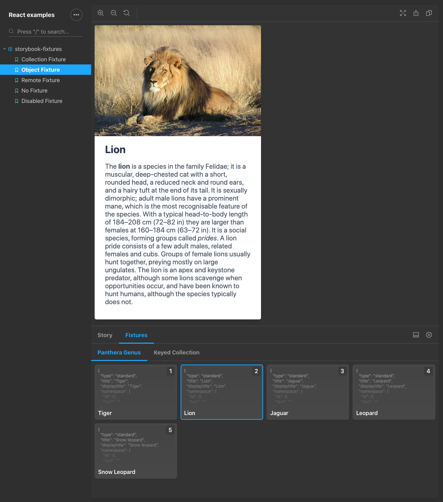

# storybook-fixtures

[](https://tyom.github.io/storybook-addons/react)
[](https://tyom.github.io/storybook-addons/vue)

Add data fixtures to your components by using local data (JSON files or hardcoded) or even URLs to fetch the data from.



## Install

```
npm install -D storybook-fixtures
```

Add `storybook-fixtures` to your addons list in `.storybook/main.js`
```js
module.exports = {
  addons: ['storybook-fixtures'],
};
```

## Usage

```js
import { withFixtures } from 'storybook-fixtures';
import pantheraData from '../__fixtures__/panthera.json';

// Global fixtures available in all stories for a given module
export default {
  title: 'storybook-fixtures',
  decorators: [
    withFixtures({
      collection: pantheraData,
    }),
  ],
};

// Currently selected fixture is injected in story context
export const myLocalFixture = ({ fixture }) => {
  return <MyComponent data={fixture} />;
};

// Fixtures that have strings as values are assumed remote URL and will be fetched
// when the story is selected.
export const myRemoteFixture = ({ fixture }) => {
  return <MyComponent data={fixture} />;
};
// Fixtures can be added per story via story parameters
myRemoteFixture.story = {
  parameters: {
    fixtures: {
      remoteFixtures: {
        'My remote fixture': 'https://example.com/data.json'
      }
    }  
  }
}
```

## Imports

### withFixtures

Fixtures decorator which communicates with Storybook Fixtures panel and shows selected fixture variants.

### keyBy

Export of Lodash utility to convert a collection (array of objects) to object, to grouped by a chosen key.
